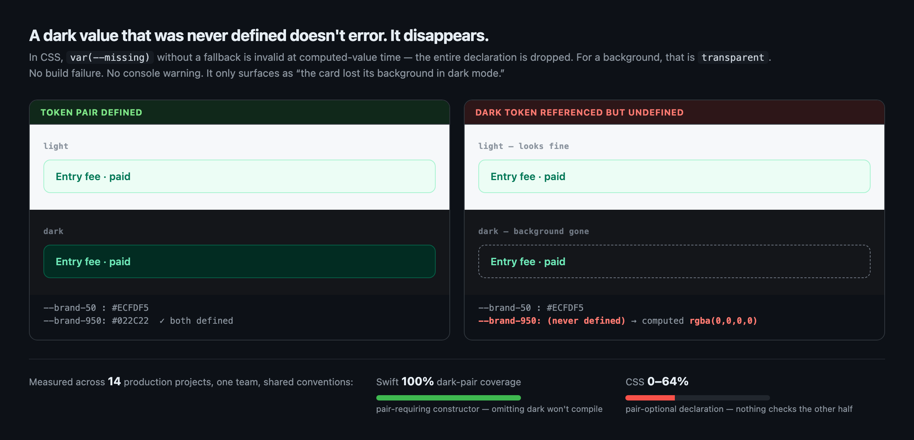

# theme-parity

Finds light/dark theme token defects across web, iOS, and Android — in one pass.

Scope, stated plainly: this reads **CSS custom properties**, **Xcode asset catalogs**, **Android `values`/`values-night` XML**, and **light/dark pair constructors in Swift**. It is not a full CSS or Swift parser, and it does not model a token graph with aliases. See [Limitations](#limitations--read-before-trusting-it).



Two failure modes it exists for:

1. **A color token has no dark counterpart.** The light value is silently reused in dark mode. Nothing errors; the build passes.
2. **A token is referenced but never defined.** In CSS, `var(--missing)` without a fallback is *invalid at computed-value time* — the whole declaration is dropped. For `background-color`, that means **transparent**. No error, no warning, no build failure. It only shows up as "the background disappeared in dark mode."

Measured in Chromium — run `python3 tests/verify_css_behavior.py` to reproduce:

```
background-color: red; background-color: var(--nope);       → rgba(0, 0, 0, 0)
background-color: red; background-color: var(--nope, blue); → rgb(0, 0, 255)
```

*(The screenshot above is rendered by a real browser and asserted — the broken card's computed `background-color` is `rgba(0, 0, 0, 0)`, not a color chosen to look transparent.)*

## What it looks like

```console
$ theme_parity.py app/assets/stylesheets --refs app/views

[css] 124 tokens · 17 with dark (14%) · backgrounds ['--surface-card', …]

🔴 [undefined-ref]  --color-primary-950  referenced in 9 place(s) (checkouts/show.html.erb et al.)
                                         — never defined, no fallback; resolves to transparent/invalid
🔴 [undefined-ref]  --qr-text-subtle     referenced in 10 place(s) (adhoc/favorites/_form.html.erb et al.)
🔴 [missing-dark]   --color-primary-50   no dark entry — the light value is reused in dark mode
⚠ [identical-modes] --border-strong      #E5E7EB in both modes — defined but not adapted
⚠ [hardcoded-total] 163 literal color(s) · 695 occurrence(s) (top 15 listed)
```

Exit code is `1` when any error-level finding exists, so it drops into CI unchanged.

## Why this is a structural problem, not a discipline problem

Across 14 real projects sharing the same team and conventions:

| Token layer | Dark-pair coverage |
|---|---|
| Swift (`make(light:dark:)` style constructor) | **100%**, every project |
| CSS custom properties | **0%–64%** |

The difference is not diligence. The Swift constructor **takes both values as required arguments** — omitting dark does not compile. CSS lets you write `--x: #fff` and walk away; the dark value lives in another block, in another file, and nothing checks that it exists.

Pair-requiring APIs don't need a rule. Pair-optional APIs need a checker. This is the checker.

## Usage

```bash
python3 theme_parity.py <token-root> [--platform auto|css|xcassets|android|swift]
python3 theme_parity.py <token-root> --refs <view-dir>    # + undefined refs, hardcoded colors
python3 theme_parity.py <token-root> --json               # exit 1 on errors
python3 theme_parity.py <token-root> --only undefined-ref # gate on one check
python3 theme_parity.py <token-root> --ignore='--brand-*'  # mute by name glob
```

`--only` and `--ignore` exist because a checker with no volume control gets muted entirely. Gate CI on `undefined-ref` first; treat the rest as advisory until the noise is down.

Note the `=`: a glob starting with `--` must be written `--ignore='--brand-*'`, otherwise argparse reads it as a flag.

Examples:

```bash
python3 theme_parity.py app/assets/stylesheets --refs app/views
python3 theme_parity.py Sources/DesignSystem --platform swift
python3 theme_parity.py app/src/main/res --platform android
```

## What it checks

| Check | Severity | Trust |
|---|---|---|
| `undefined-ref` — referenced token has no definition, no fallback | error | **High.** Existence is a mechanical fact. |
| `missing-dark` — no dark counterpart | error | **High**, but some tokens legitimately need none (logo colors, launcher backgrounds). |
| `identical-modes` — dark is defined but equal to light | warn | High. Defined ≠ adapted. |
| `missing-light` — dark defined with no light counterpart | error | High. Same check, opposite direction. |
| `hardcoded-color` — color literal found in a scanned file | warn | **Low-medium.** Detects the literal, not whether it renders. |
| `low-contrast` — WCAG pair check | warn/error | **Low by default.** Backgrounds are guessed from token names. Pass `--bg` to make it meaningful. |
| `cvd-collision` — categorical colors indistinguishable under color-vision deficiency | warn/error | Medium. Use `--group <prefix>` for speaker/tag/chart color sets. |

Sort your attention by that last column. A checker that reports 200 findings of mixed quality gets ignored entirely — which is worse than no checker.

## Limitations — read before trusting it

This was built against a specific stack and is honest about that:

- **CSS parsing is regex-based.** Nested rules, SCSS control flow, and CSS-in-JS are not properly handled. Flat custom-property blocks work well; complex preprocessor output may be misread.
- **The Swift loader keys on a `make(light:dark:)`-shaped declaration.** Projects using Asset Catalogs, `UITraitCollection` closures written differently, or another naming convention will read **zero tokens** — which the tool reports as a failure rather than a pass, but it still means no coverage.
- **Android reads `res/values/colors.xml` vs `values-night/`.** Jetpack Compose `Color.kt` / `lightColorScheme` is **not** parsed yet. On Compose-first projects the token count will be misleadingly small.
- **`low-contrast` infers backgrounds from token names** and produces false positives. It is a hint, not a verdict.
- **Reference scanning is text-based, not semantic.** Comments are stripped before scanning, but string literals are not distinguished from code. A color literal inside a JS string or documentation snippet can be reported as hardcoded.
- **`hardcoded-color` means "a color literal was found in this file"**, not "this color is rendered". Gradients, SVG fills, and example code all match.
- **Android resolution is simplified.** `values-night` is treated as dark and everything else as light; qualifier precedence (`values-night-v31`, `values-land`, …) is not modeled the way the platform resolves it.
- **The 14-project figures quoted above come from private repositories** and are not reproducible from this repo. Treat them as the author's measurement, not as independently verifiable data. The CSS behavior claim *is* reproducible — see `tests/verify_css_behavior.py`.
- **Verified on ~14 projects of similar shape** (Rails + Tailwind, SwiftUI). Behavior on other stacks is untested.
- Messages default to English; `--lang ko` switches to Korean. Source comments are in Korean.

If it reads zero tokens it exits with an error rather than reporting success — reporting "0 problems" when the real cause is "0 files parsed" is the exact failure this tool was written to prevent.

## Design notes

- **The checker never stores expected values.** It parses the source of truth directly. A checker holding its own copy of the canon goes green while the canon drifts.
- **No silent fallbacks.** "If dark is missing, assume light" makes an omission indistinguishable from a deliberate match. Missing fails; deliberate sameness must be written explicitly.
- **Generated output is excluded** (`builds/`, `dist/`, `node_modules/`, `.build/`, …). Counting generated files as definitions hides drift.
- **Definition-ness and color-parseability are separate.** Otherwise every non-color token (`--radius-*`, `--shadow-*`) is reported as undefined and the output becomes noise.

## Tests

```bash
python3 tests/test_audit.py     # direct
python3 -m pytest tests/ -q     # pytest
```

The suite plants known defects and asserts they are caught, and asserts that legitimate neighbours are *not* flagged — false positives are what get a checker ignored, so they are tested as failures too.

## Requirements

Python 3.8+ and no dependencies for the checker. `tests/verify_css_behavior.py` additionally needs playwright.

## License

MIT
